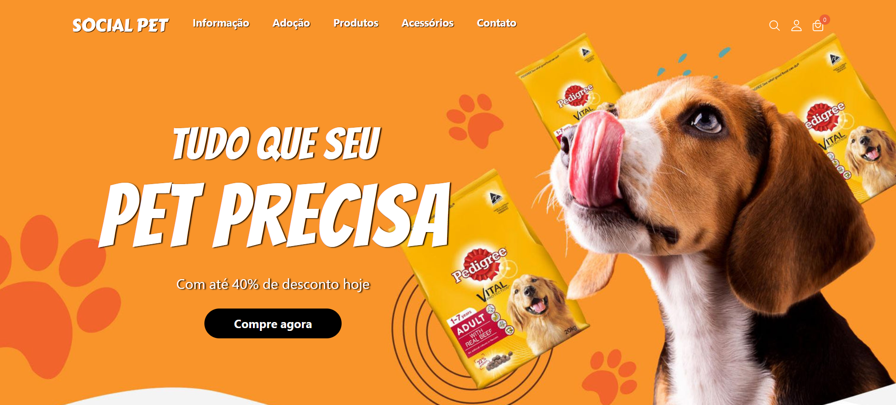
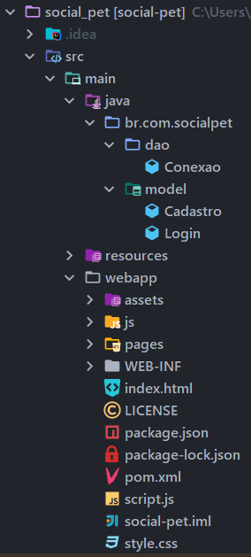
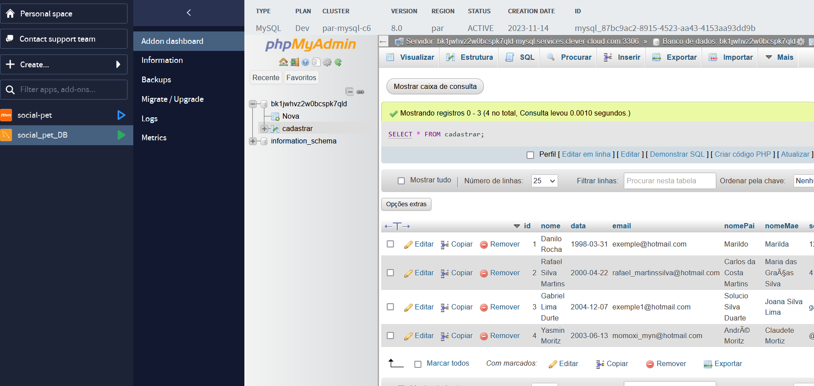
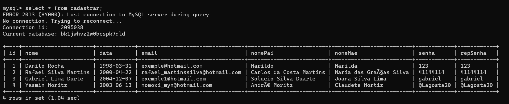

## COMO INICIAR

1 - FAÇA UM FORK DESSE REPOSITÓRIO, TODAS E QUAISQUER ALTEREÇÕES PRECISAM SER ADICIONADAS ATRAVES DE PULL REQUESTS.

## ORIENTAÇÕES PARA PULL REQUEST

Como esse projeto vai sofrer bastante alteração durante o desenvolvimento, preciso que vocês sigam a seguinte orientação para o desenvolvimento correto:

1 - Adicionar o repositório original como um remote:

Use o comando <strong>git remote add</strong> para adicionar o repositório original como um controle remoto em seu repositório local. Substitua upstream pelo nome que você desejar para o controle remoto (geralmente é chamado de upstream). Certifique-se de substituir URL_DO_REPOSITORIO_ORIGINAL pela URL do repositório original.

      git remote add upstream URL_DO_REPOSITORIO_ORIGINAL

Então ficará assim:

      git remote add upstream https://github.com/DevNylo/social-pet.git

  - Após isso use o comando: <strong>git fetch upstream</strong> para verificar as alterações do repositório compartilhado.
  - Agora use o comando <strong>git merge upstream/main</strong>, não esqueça de substituir o "main" para o nome do branch que você está utilizando, isso fará que as alterações do repositório compartilhado vá para seu repositório local.
  - Agora envie as alterações para seu fork no GitHub com o comando <strong>git push </strong>origin, main ou master dependendo de como estiver renomeado sua branch.
  - Pronto, está tudo sincronizado, agora só codar.

2 - Não é necessário usar o comando <strong>git remote add</strong> novamente, o comando <strong>git remote -v</strong> vai mostrar as URL remota vinculadas ao seu fork.

3 - Agora não esqueça, toda vez que for codar, execute esses passos para manter seu fork atualizado e evitar que dê conflito com o amiguinho ao fazer pull request.

## SOBRE O SITE

#### Um site para cadastros de informações de animais de estimação, você poderá criar o seu cadastro e acessar as informações do seu pet na palma da sua mão, A SOCIAL PET possui seu banco de dados remoto no servidor do Clever Cloud.

## ESTRUTURA DA APLICAÇÃO.

Possuímos 3 classes, uma para coneção e outra para fazer requisições Post para o banco de dados, infelizmente não adicionamos muitas regras de autentificação por ser apenas um projeto simples, basicamente com baixar regra de negócio.

O front-end da nossa página está inserida na pasta <strong>WEBAPP.</strong>

## BANCO DE DADOS MYSQL

O nosso banco de dados como eu ja disse, está armazenado no servidor remoto da Clever Cloud de forma gratuita. A estrutura do nosso banco consiste apenas em uma tabela chamada CADASTRO onde armazenamos os dados dos nossos clientes.

